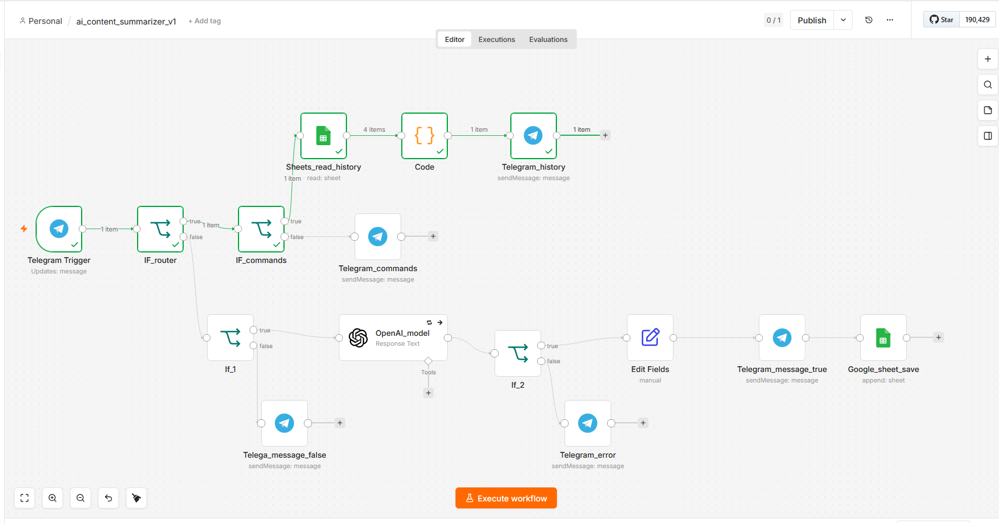

# AI Content Summarizer

Telegram-бот для автоматического анализа текстов с помощью GPT-4o-mini.

## Что делает

Принимает текст статьи → возвращает:
- краткое резюме
- 3 ключевых тезиса  
- категорию темы
- логирование каждого запроса в Google Sheets (timestamp, текст, резюме, категория)

## Архитектура

Telegram → IF (>100 символов) → OpenAI JSON mode → Edit Fields → Telegram
↓ false
"Пришли текст статьи"

## Стек

- n8n (Docker, localhost)
- OpenAI GPT-4o-mini
- Telegram Bot API
- Google Sheets API (Service Account)

## Как запустить

1. Импортируй `ai_content_summarizer_v1.json` в n8n
2. Добавь credentials:
   - OpenAI API key
   - Telegram Bot token
3. Активируй workflow

## Демо

## Бизнес-ценность

Экономит 5–10 минут на каждой статье.
Подходит для: контент-маркетологов, SMM, медиа, аналитиков.
